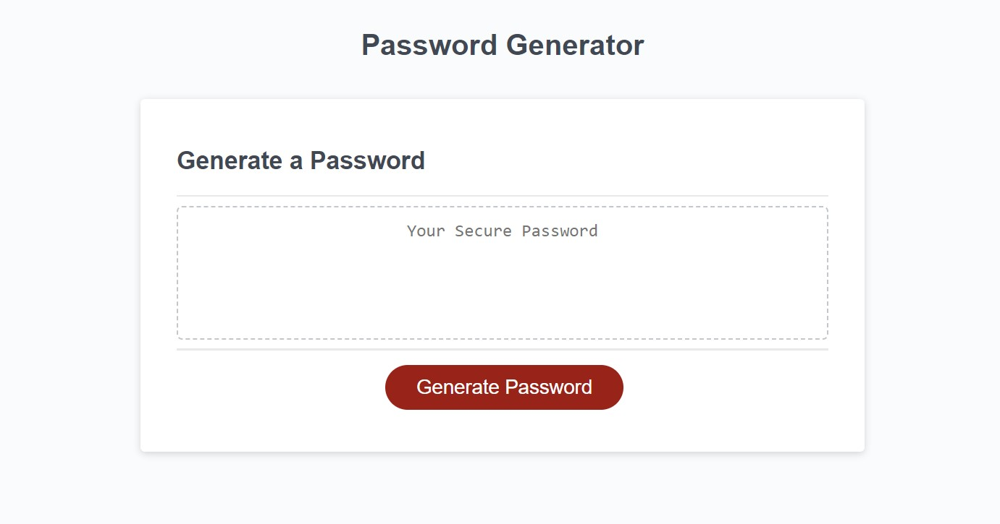

# Random Password Generator

## Description

This webpage's purpose is to generate a random password for the user. When the user presses the button to generate a password, they are asked a set of prompts. These prompts will ask if they would like to include special characters, uppercase letters, or numbers within their password, as well as if they would like to specify the length of the password. The password legth is set to a range of 8-128 characters. If the user selects to not specify the length, a length between 8-128 will be chosen at random. If the user would like to sepcify length, the value they enter must be between 8-128 or they will receive a reminder message about this rule. If the user decides that they do not want to specify a length and also do not want to add any numbers, characters, or uppercase letters, a string of lowercase letters will be chosen at random, with the spring length also being chosen at random between 8-128. When the random password is generated, it will be displayed within the text box on the screen. 

The purpose of this challange was to better my understanding of javascript components, including: logical comparison operaters, objects, while&for loops, functions, data structures, variables, etc.. Through completing this assignment, I have been introduced to the world of Javavscript, and can use this as my stepping stone in further secured understanding.

## Installation

No installation is required by the user to use this application. 

## Usage

To use this site, the user must click on the generate button, and answer a set of 4-5 prompted questions. Once they've completed these questions they are presented with a password, meeting both the user's and password length requirements. 

### Page View

